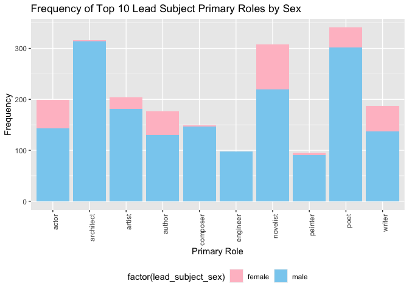
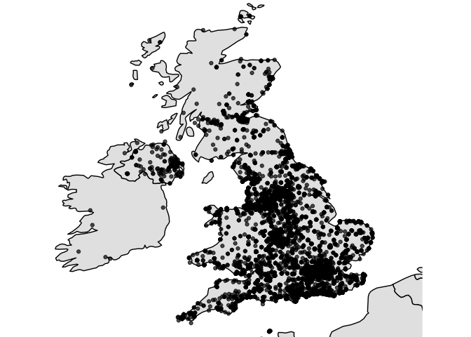
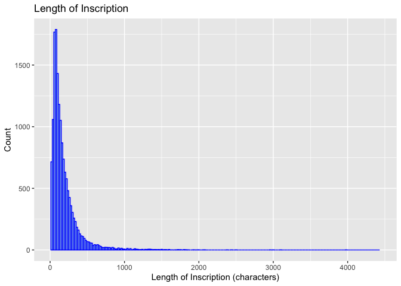
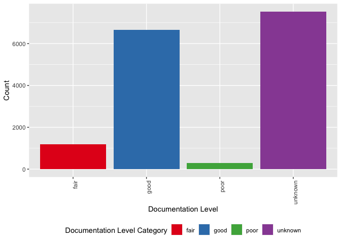
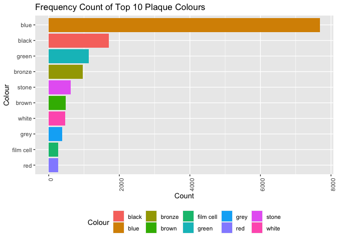
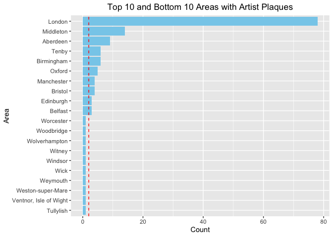

Open Plaques - UK
================
Esraa Dandash
01/03/2023

## Data

The data for this markdown file are taken from
[https://openplaques.org/data/](openplaques.org) (openplaques.org
(2023))

see also (programmingr.com (2023))

For initial testing, we can look at a sample of data, to confirm that it
has loaded properly

``` r
# set to include=TRUE for testing, and then revert to include=FALSE
head(plaques)
```

    ## # A tibble: 6 × 37
    ##      id machine_tag    title inscription latitude longitude as_wkt country area 
    ##   <dbl> <chr>          <chr> <chr>          <dbl>     <dbl> <chr>  <chr>   <chr>
    ## 1 41936 openplaques:i… Abbo… Abbotskers…     50.5     -3.61 POINT… United… Abbo…
    ## 2  4856 openplaques:i… Arth… World Cham…     51.7     -3.43 POINT… United… Aber…
    ## 3 30088 openplaques:i… Alfr… Alfred 'Ce…     52.0     -5.13 POINT… United… Aber…
    ## 4 53515 openplaques:i… Blac… Bryn Sion …     52.0     -4.55 POINT… United… Aber…
    ## 5  1729 openplaques:i… Navi… Navigation…     51.6     -3.33 POINT… United… Aber…
    ## 6 43575 openplaques:i… John… Sefydlwyd …     51.6     -3.33 POINT… United… Aber…
    ## # ℹ 28 more variables: address <chr>, erected <dbl>, main_photo <chr>,
    ## #   colour <chr>, organisations <chr>, language <chr>, series <chr>,
    ## #   series_ref <chr>, `geolocated?` <lgl>, `photographed?` <lgl>,
    ## #   number_of_subjects <dbl>, number_of_male_subjects <dbl>,
    ## #   number_of_female_subjects <dbl>, number_of_inanimate_subjects <dbl>,
    ## #   lead_subject_id <dbl>, lead_subject_machine_tag <chr>,
    ## #   lead_subject_name <chr>, lead_subject_surname <chr>, …

## Main Objective

In this file we aim to analyse different aspects in the plaques dataset
using a number of R libraries such as ggplot, ggmap and dplyr. We
wrangle and aggregate the data, visualise it, identify patterns in it,
analyse room for growth in the data and explore a number of particularly
helpful references that can be of value to anyone looking to produce
similar R functions and visualisations.

## Data Sources

The specific data sources for this dataset were not explicitly included
on the website above. The data could have been sourced from various
places, including public records, historical archives, online databases,
or crowdsourced efforts. (ResidentMario (2023))

## Data Overview

The dataset at hand comprises information about plaques, specifically
focusing on their attributes, inscriptions, and associated subjects. It
provides a comprehensive collection of data related to these
commemorative markers. The dataset serves as a valuable resource for
exploring and studying historical plaques and the individuals they
commemorate. The full list of data types in the dataset is provided in
the table below:

| Field Name                   | Type      | Meaning                                                 |
|------------------------------|-----------|---------------------------------------------------------|
| id                           | Numeric   | Unique identifier for each plaque                       |
| machine_tag                  | Character | Machine-readable tag associated with the plaque         |
| title                        | Character | Title of the plaque                                     |
| inscription                  | Character | Inscription on the plaque                               |
| latitude                     | Numeric   | Latitude coordinate of the plaque                       |
| longitude                    | Numeric   | Longitude coordinate of the plaque                      |
| as_wkt                       | Character | Well-Known Text representation of the plaque’s location |
| country                      | Character | Country where the plaque is located                     |
| area                         | Character | Area within the country where the plaque is located     |
| address                      | Character | Address of the plaque                                   |
| erected                      | Numeric   | Year of erection of the plaque                          |
| main_photo                   | Character | URL or file path of the main photo of the plaque        |
| colour                       | Character | Colour of the plaque                                    |
| organisations                | Character | Organizations associated with the plaque                |
| language                     | Character | Language of the inscription on the plaque               |
| series                       | Character | Series to which the plaque belongs                      |
| series_ref                   | Character | Reference number of the series                          |
| geolocated?                  | Boolean   | Indicates if the plaque is geolocated                   |
| photographed?                | Boolean   | Indicates if the plaque is photographed                 |
| number_of_subjects           | Numeric   | Total number of subjects depicted on the plaque         |
| number_of_male_subjects      | Numeric   | Number of male subjects depicted on the plaque          |
| number_of_female_subjects    | Numeric   | Number of female subjects depicted on the plaque        |
| number_of_inanimate_subjects | Numeric   | Number of inanimate subjects depicted on the plaque     |
| lead_subject_id              | Numeric   | Unique identifier for the lead subject                  |
| lead_subject_machine_tag     | Character | Machine-readable tag for the lead subject               |
| lead_subject_name            | Character | Name of the lead subject                                |
| lead_subject_surname         | Character | Surname of the lead subject                             |
| lead_subject_sex             | Character | Sex of the lead subject                                 |
| lead_subject_born_in         | Numeric   | Year of birth of the lead subject                       |
| lead_subject_died_in         | Numeric   | Year of death of the lead subject                       |
| lead_subject_type            | Character | Type of the lead subject                                |
| lead_subject_roles           | Character | Roles of the lead subject                               |
| lead_subject_primary_role    | Character | Primary role of the lead subject                        |
| lead_subject_wikipedia       | Character | Wikipedia page of the lead subject                      |
| lead_subject_dbpedia         | Character | DBpedia page of the lead subject                        |
| lead_subject_image           | Character | URL or file path of the image of the lead subject       |
| subjects                     | Character | Subjects depicted on the plaque                         |

## Data Cleaning, Wrangling

Data cleaning and wrangling involve preparing and transforming raw data
into a clean and structured format for analysis. Some of the most
commonly used ones that we leveraged in our analysis and producing the 7
plots in this file are as follows:

1.  Handling missing values: Identify and handle missing data using
    functions like `is.na()` to retrieve and change (mutate) dataset
    values such as plot 2,4 and 6.

2.  Data transformation: Apply mathematical operations or create new
    variables using functions like `mutate()` in plots 2 and 4.

3.  Filtering and subsetting: Subset data based on specific conditions
    using functions like `subset()` or the `filter()` function from the
    `dplyr` package. Select specific columns using the `$` operator or
    functions like `select()`. These have been all used in the 7 plots
    for processing the data before anlysing it.

4.  Aggregating and summarizing data: Aggregating data using functions
    like `aggregate()` or `summarize()` from the `dplyr` package.
    Calculate summary statistics, group data by specific variables, or
    compute aggregate values as in plot 4 and plot 6.

5.  Data joining: Combine datasets vertically using functions like
    `rbind()` as in plot 7.

## \## Plot 1: Analysis of Primary Roles

**Objective and Methodology**: We study the top 10 most frequent
“primary roles” by using the table function and sorting the frequencies
in descending order. We create a subset of the data that includes only
the plaques with these top 10 roles. Finally, we create a stacked bar
chart using ggplot, where the x-axis represents the “primary roles”, the
fill color represents the “sex”, and the height of the bars represents
the frequency of each role. The resulting chart provides insights into
the distribution of primary roles by sex.  
**Results**: A significant under-respresentation of women can be
observed.

``` r
# Filter out objects with "object" sex and empty primary roles
filtered_plaques <- subset(plaques, lead_subject_sex != "object" & lead_subject_primary_role != "")

# Get the count of unique primary roles in the filtered data
unique_roles <- unique(filtered_plaques$lead_subject_primary_role)
num_roles <- length(unique_roles)

# Print the unique roles and their count (for debugging)
#print(unique_roles)
#print(num_roles)
# Get the top 10 primary roles by frequency
top_roles <- names(sort(table(filtered_plaques$lead_subject_primary_role), decreasing = TRUE)[1:10])

# Create a subset of the filtered data with only the top 10 roles
subset_plaques <- subset(filtered_plaques, lead_subject_primary_role %in% top_roles)

# Create a stacked bar chart of the top 10 roles
ggplot(subset_plaques, aes(x = factor(lead_subject_primary_role), fill = factor(lead_subject_sex))) + 
  geom_bar(position = "stack") +
  scale_fill_manual(values = c("#FFC0CB", "#89CFF0")) +
  theme(legend.position = "bottom", axis.text.x = element_text(angle = 90, hjust = 1), plot.width = NULL) +
  labs(title = "Frequency of Top 10 Lead Subject Primary Roles by Sex",
       x = "Primary Role", y = "Frequency")
```

<!-- -->

## Plot 2: Analysis of Location - By Cities (Spatial Scatterplot)

**Objective and Methodology**: Here we are using the ggmap and maps
libraries to create a world map visualization with plotted points
representing plaque locations. We are limiting the map to UK coordinates
only to understand more about the distributions. (Kahle (2013))  
**Results**: Concentration of plaques in urban areas, particularly in
major cities like London, Manchester, and Edinburgh.

``` r
library(ggmap)
```

    ## ℹ Google's Terms of Service: <https://mapsplatform.google.com>
    ## ℹ Please cite ggmap if you use it! Use `citation("ggmap")` for details.

``` r
library(maps)
```

    ## 
    ## Attaching package: 'maps'
    ## 
    ## The following object is masked from 'package:purrr':
    ## 
    ##     map

``` r
#extract the latitude and longitude coordinates from the plaques dataset
lat <- plaques$latitude
lng <- plaques$longitude
#load the world map data 
worldmap = map_data('world')
geocorrected = plaques %>%
  mutate(lat = as.numeric(lat)) %>%
  mutate(lng = as.numeric(lng)) %>%
  filter(!is.na(lat)) %>% filter(!is.na(lng))
ggplot() +
  geom_polygon(data = worldmap,
               aes(x = long, y = lat, group = group),
               fill = 'gray90', color = 'black') +
  coord_fixed(ratio = 1.3, xlim = c(-10,3), ylim = c(50, 59)) +
  theme_void() +
  geom_point(data = geocorrected,
             aes(x = as.numeric(lng),
                 y = as.numeric(lat)),
                 alpha = .7) +
  scale_size_area(max_size = 8) +
  scale_color_viridis_c() +
  theme(legend.position = 'none') +
  theme(title = element_text(size = 12))
```

<!-- -->

## Plot 3: Analysis of Inscription Length

**Objective and Methodology**: Here, we are calculating the length of
each inscription in the plaques dataset using the nchar function and
storing it in the insc_length variable. We then determine the range of
inscription lengths using the range function and print the resulting
limits.  
**Results**: Vast majority of inscriptions are less than 800 characters.

``` r
insc_length <- nchar(plaques$inscription)
x_limits <- range(insc_length)
print(x_limits)
```

    ## [1]    7 4437

``` r
ggplot(data = plaques, aes(x = str_length(inscription))) +
  geom_histogram(binwidth = 20, color = "blue", fill = "lightblue") +
  xlim(x_limits) +
  labs(title = "Length of Inscription",
       x = "Length of Inscription (characters)",
       y = "Count")
```

    ## Warning: Removed 2 rows containing missing values (`geom_bar()`).

<!-- -->

## Plot 4: Analysis of Documentation Techniques

**Objective and Methodology**: Here, we assess the documentation quality
of the plaques in the dataset. The code calculates the documentation
level based on the presence or absence of information in the
lead_subject_wikipedia, lead_subject_dbpedia, photographed, and
geolocated fields. It then groups the plaques by their documentation
level and creates a bar chart to visualize the count of plaques in each
documentation level category. This analysis helps evaluate the
completeness and reliability of the documentation associated with the
plaques, providing insights into the overall quality of the dataset’s
information.  
**Results**: Vast majority of inscriptions are relatively good in terms
of documentation. Further data investigation needs to be done to
udnerstand why it is showing most as unknown.

``` r
library(dplyr)
plaques <- rename(plaques, `photographed` = `photographed?`)
plaques <- rename(plaques, `geolocated` = `geolocated?`)

plaques_summary <- plaques %>%
  summarize(
    lead_subject_wikipedia_empty = sum(is.na(lead_subject_wikipedia)),
    lead_subject_wikipedia_not_empty = sum(!is.na(lead_subject_wikipedia)),
    lead_subject_dbpedia_empty = sum(is.na(lead_subject_dbpedia)),
    lead_subject_dbpedia_not_empty = sum(!is.na(lead_subject_dbpedia)),
    photographed_true = sum(photographed),
    photographed_false = sum(!photographed),
    geolocated_true = sum(geolocated),
    geolocated_false = sum(!geolocated),
  )
glimpse(plaques_summary)
```

    ## Rows: 1
    ## Columns: 8
    ## $ lead_subject_wikipedia_empty     <int> 7531
    ## $ lead_subject_wikipedia_not_empty <int> 8134
    ## $ lead_subject_dbpedia_empty       <int> 7531
    ## $ lead_subject_dbpedia_not_empty   <int> 8134
    ## $ photographed_true                <int> 12690
    ## $ photographed_false               <int> 2975
    ## $ geolocated_true                  <int> 14674
    ## $ geolocated_false                 <int> 991

``` r
plaques %>%
  mutate(documentation_level = case_when(
           !is.na(lead_subject_wikipedia) + !is.na(lead_subject_dbpedia) + photographed + geolocated == 0 ~ "poor",
           !is.na(lead_subject_wikipedia) + !is.na(lead_subject_dbpedia) + photographed + geolocated == 1 ~ "fair",
           !is.na(lead_subject_wikipedia) + !is.na(lead_subject_dbpedia) + photographed + geolocated == 2 ~ "good",
           !is.na(lead_subject_wikipedia) + !is.na(lead_subject_dbpedia) + photographed + geolocated == 3 ~ "very good",
           !is.na(lead_subject_wikipedia) + !is.na(lead_subject_dbpedia) + photographed + geolocated == 4 ~ "excellent",
           TRUE ~ "unknown" )) %>%

  group_by(documentation_level) %>%
  summarize(count = n()) %>%
  ggplot(aes(x = documentation_level, y = count, fill = documentation_level)) +
  geom_bar(stat = "identity") +
  scale_fill_manual(values = c("#e41a1c", "#377eb8", "#4daf4a", "#984ea3", "#ff7f00")) +
  theme(legend.position = "bottom", axis.text.x = element_text(angle = 90, hjust = 1), plot.width = NULL) +
  labs(x = "Documentation Level", y = "Count", fill = "Documentation Level Category")
```

<!-- -->

## Plot 5: Analysis of Colour

**Objective and Methodology**: Here, we analyze the frequency count of
plaque colours in the dataset and create a bar chart to visualize the
top 10 colours.The code generates a bar chart using ggplot2 with the
x-axis representing the reordered colour categories based on their
count, the y-axis representing the count, and the fill colour matching
the value of each colour category. The chart is displayed with a flipped
coordinate system, and the title, x-label, and y-label are added for
better visualization and understanding.  
**Results**: The visualizations reveal a diverse range of plaque colors,
indicating variations in materials and styles used for plaques. The most
sued colour however is blue.

``` r
# Generate a frequency count for the "colour" field and select top 10 colours
colour_counts <- data.frame(table(plaques$colour))
colnames(colour_counts) <- c("Colour", "Count") 
# print(colour_counts)
colour_counts <- head(colour_counts[order(colour_counts$Count, decreasing = TRUE),], 10)
# slate is an unknown colour so I will replace it, not wowking still 
# Create the bar chart with fill color matching the value of Colour, mapping still not working 
ggplot(colour_counts, aes(x=reorder(Colour, Count), y=Count, fill=Colour)) +
  geom_bar(stat="identity") +
  coord_flip() +
  theme(legend.position = "bottom", axis.text.x = element_text(angle = 90, hjust = 1), plot.width = NULL) +
  ggtitle("Frequency Count of Top 10 Plaque Colours") +
  xlab("Colour") +
  ylab("Count")
```

<!-- -->

## Plot 6: Analysis of year of installation/erection

**Objective and Methodology**: Here, we analyze the count of plaques by
year of erection and lead subject sex, and create a visualization after
trying to understand the data using `summarize`. The resulting data is
used to create a scatter plot and line plot using ggplot2. The x-axis
represents the year of erection, the y-axis represents the count, and
the color of the points and lines is determined by the lead subject sex.
(QuestionPro (2023))

The visualization is further enhanced by using facet_wrap() to create
separate panels for each lead subject sex, and scale_x\_continuous() to
limit the x-axis range from 1800 to 2023 for better visibility and
interpretation.  
**Results**: Most of the plaques are quite recent regardless of their
types (object, male or female).

``` r
library(dplyr)

plaques %>%
  filter(!is.na(erected)) %>% 
  filter(!is.na(lead_subject_sex)) %>% 
  group_by(lead_subject_sex, erected) %>%
  summarize(count = n()) %>%
  ggplot(aes(x = erected, y= count, color = lead_subject_sex)) +
  geom_point() +
  geom_line() +
  facet_wrap(~ lead_subject_sex, ncol = 1) +
  scale_x_continuous(limits = c(1800, 2023)) +
  labs(x = "Year of erection", y = "Count") 
```

    ## `summarise()` has grouped output by 'lead_subject_sex'. You can override using
    ## the `.groups` argument.

    ## Warning: Removed 3 rows containing missing values (`geom_point()`).

    ## Warning: Removed 3 rows containing missing values (`geom_line()`).

<!-- --> \## Plot 7:
Analysis of Specific Role Distributions **Objective and Methodology**:
The purpose of this plot is to analyze the distribution of artist
plaques across different areas and create a bar chart showing the counts
of artist plaques in the top 10 and bottom 10 areas. The code selects
rows from the dataset where the ‘lead_subject_primary_role’ column
contains the word “artist” and stores them in a separate data frame. It
then calculates the counts of artist plaques for each area using regular
expression (Peng (2023)) and lead subject primary role combination. The
top and bottom areas are determined based on these counts, and a new
data frame is created combining the top and bottom areas. Finally, a bar
chart is generated using ggplot2, displaying the counts of artist
plaques for each area, with the areas reordered by count and bars
colored in sky blue. The chart also includes a title, labels for the
axes, and a dashed line representing the median count.

**Results**: London has the most number of plaques followed by Middleton
with a big difference, which makes since since there are many art
galleries and a keen apporach to preserve arts in the capital. Tullylish
ahs the smallest number of Plaques for artists.

``` r
library(dplyr)

# Select only the rows where the 'lead_subject_primary_role' column contains the word "artist"
artist_plaques <- plaques[grep("artist", plaques$lead_subject_primary_role, ignore.case = TRUE), ]
artist_areas <- artist_plaques %>%
  select(area, lead_subject_primary_role)

# Create a  table of the counts of each area and lead subject primary role combination
area_counts <- table(artist_areas)

# Get the total counts for each area
area_totals <- rowSums(area_counts)

# Create a data frame of the areas and their corresponding counts
area_df <- data.frame(area = names(area_totals), count = area_totals)

# Sort the data frame by the counts in descending order
area_df <- area_df %>%
  arrange(desc(count))

# Select the top 10 and bottom 10 areas
top_areas <- head(area_df, 10)
bottom_areas <- tail(area_df, 10)

# Combine the top 10 and bottom 10 data frames
plot_df <- rbind(top_areas, bottom_areas)

# Create a bar chart of the counts for each area
ggplot(plot_df, aes(x = reorder(area, count), y = count)) +
  geom_bar(stat = "identity", fill = "skyblue") +
  ggtitle("Top 10 and Bottom 10 Areas with Artist Plaques") +
  xlab("Area") +
  ylab("Count") +
  coord_flip() +
  theme(plot.title = element_text(hjust = 0.5),
        legend.position = "bottom") +
  geom_hline(yintercept = median(plot_df$count), linetype = "dashed", color = "red")
```

<!-- -->

## Summary of Notable Features and Patterns in Visualisations

Through the analysis and visualizations of the plaqes dataset, we have
observed notable patterns and insights:  
\* The dataset shows a notable concentration of plaques in urban areas,
particularly in major cities like London, Manchester, and Edinburgh.
This raise the questions of whether or not that is due to the increase
of interested organisations in theses areas or the desire to show them
to more people.  
\* The visualizations reveal a diverse range of plaque colors,
indicating variations in materials and styles used for plaques.  
\* Another interesting pattern is the presence of multiple languages on
the plaques, reflecting the multicultural heritage and history of the
regions.  
\* The dataset also highlights the significance of gender
representation, with a number of plaques dedicated to notable women and
their contributions.

In the data itself, a significant pattern observed is the high number of
plaques associated with historical landmarks, such as castles,
cathedrals, and famous buildings although it has not been visualised in
this R project. \## Further Development \* Demographically, the datset
could be more developed by including ethinicities, educational
backgrounds and other parameters that can help identify representation
of all parties.  
\* Improving documentation by including correct, full information of the
plaques and checking for null values.  
\* Leveraging natural language processing techniques could help gain
insights into the inscriptions, unraveling hidden meanings and
historical contexts.  
\* The `erected` variable in particular is missing most of its data, and
I believe relating the ages of the plaques to historical events and
timelines could provide valuable historical context and facilitate a
better conclusion on whether organisations are producing ones in an
increasing or declining manner.

# Bibliography

<div id="refs" class="references csl-bib-body hanging-indent">

<div id="ref-rjournal2013" class="csl-entry">

Kahle. 2013. “RJournal - Spatial Visualization with Ggplot2.”
<https://journal.r-project.org/archive/2013-1/kahle-wickham.pdf>.

</div>

<div id="ref-openplaques2023" class="csl-entry">

openplaques.org. 2023. “Openplaques.org Database.” 2023.
<https://openplaques.org/data/>.

</div>

<div id="ref-bookdown2023b" class="csl-entry">

Peng. 2023. “Regular Expressions.” 2023.
<https://bookdown.org/rdpeng/rprogdatascience/regular-expressions.html>.

</div>

<div id="ref-r-error-messages2023" class="csl-entry">

programmingr.com. 2023. “R-Error-Messages.” 2023.
<https://www.programmingr.com/r-error-messages/error-in-contrib-urlrepos-source-r-markdown/#>.

</div>

<div id="ref-questionpro2023" class="csl-entry">

QuestionPro. 2023. “Demographic Examples.” 2023.
<https://www.questionpro.com/blog/demographic-examples/>.

</div>

<div id="ref-kaggle2023" class="csl-entry">

ResidentMario. 2023. “Exploring Blue Plaques Dataset.” 2023.
<https://www.kaggle.com/code/residentmario/exploring-blue-plaques>.

</div>

</div>
